::: {.cover}
# Linux Laboratory

## Part 1 & Part 2

**GIK2NV – Data storage and management technologies**

Date: [DATE]

| Name | DU-ID |
|---|---|
| Bilal [Last name] | [DU-ID] |
| Ali [Last name] | [DU-ID] |
| Merat [Last name] | [DU-ID] |
| Hussein [Last name] | [DU-ID] |

Video presentation: [YouTube link]

**Video presentation, division of work:** Bilal – introduction and Part 1 tasks 1–3 · Ali – Part 1 tasks 4–5 · Merat – Part 1 task 6 and the Part 2 script code · Hussein – running and testing the Part 2 script.
:::

# Laboratory environment

The lab was carried out on **Ubuntu 24.04 LTS** (hostname `linux-lab`). All administrative commands are run as `root` (on a normal user account, put `sudo` in front of each command). The users and groups below were used in Part 1:

| Department | Group | Administrator | Users |
|---|---|---|---|
| Engineering | Engineering | eng_admin | eng_user1, eng_user2 |
| Sales | Sales | sales_admin | sales_user1, sales_user2 |
| HR | HR | hr_admin | hr_user1, hr_user2 |

# Part 1 – User Management

## Task 1: Create a directory at the root (/) for each department

We go to the root of the file system with `cd /` and use `mkdir` to create one directory per department, each named after its department. `ls -ld` verifies that the three directories exist directly under `/`.

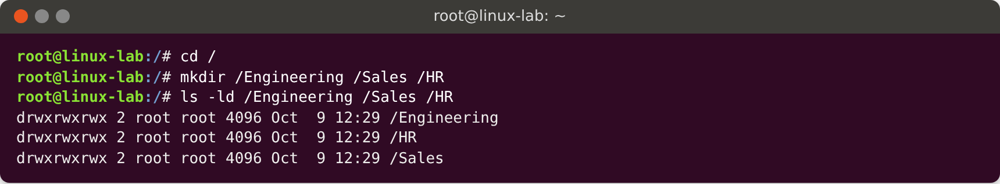

## Task 2: Create a group for each department

`groupadd` creates one group per department, each named after its department. `getent group` verifies that the groups exist in `/etc/group`.

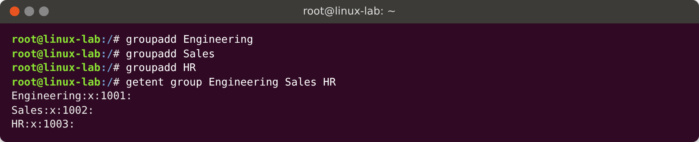

## Task 3: Create an administrative user for each department

`useradd` creates the three administrators:

- `-m` creates a home directory,
- `-s /bin/bash` gives the user a **Bash login shell** (3a),
- `-g <group>` sets the department group as the user's **primary group** (3b).

`id` shows that the primary group (`gid`) is the department group, and `/etc/passwd` shows that the login shell is `/bin/bash`.

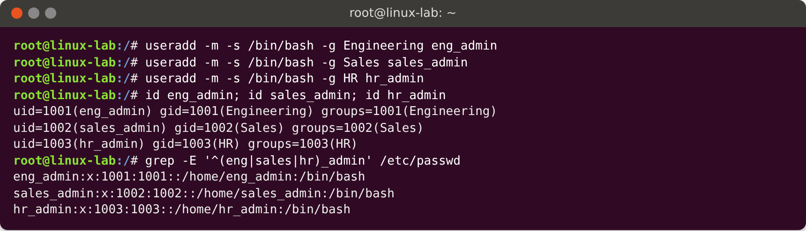

## Task 4: Create two additional users for each department

The same `useradd` options give each regular user a Bash login shell (4a) and the department group as primary group (4b). The output of `id` and `/etc/passwd` verifies this.

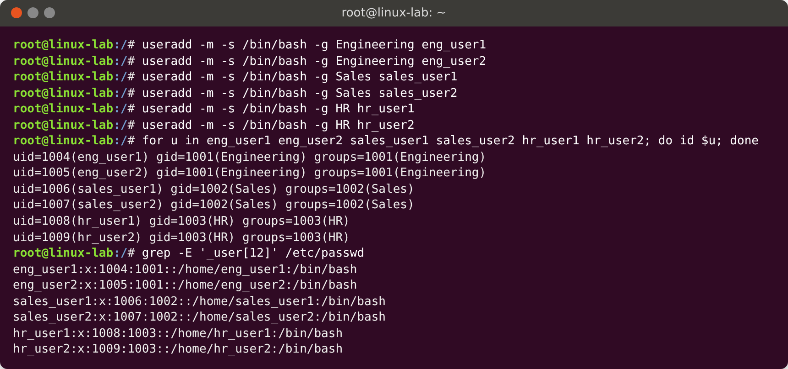

## Task 5: Secure the department directories

### 5a – Owner is the department admin, group is the department group

`chown user:group` sets both the owner and the group owner in a single command. `ls -ld` shows the new owner and group.

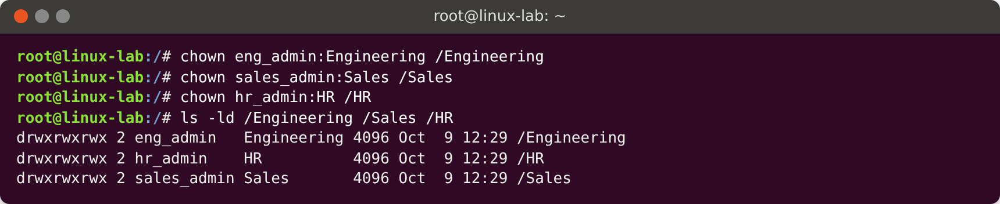

### 5b–5e – Permissions

All of the permission requirements are covered by one command, `chmod 1770`:

| Digit | Meaning | Requirement |
|---|---|---|
| **1** | Sticky bit: only the owner of a file can delete it | 5c |
| **7** | Owner (department admin): read, write, execute (full access) | 5b, 5c |
| **7** | Group (department users): read, write, execute (full access) | 5d |
| **0** | Others: no permissions at all | 5e |

In the `ls -ld` output, `drwxrwx--T` shows `rwx` for owner and group and `---` for others. The `T` at the end is the sticky bit.

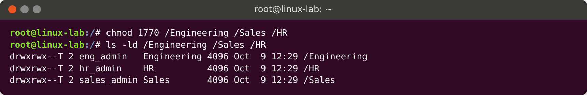

### Testing the directory permissions

- The admin (5b) and a regular user (5d) can both create files in the department directory.
- `eng_user2` cannot change or delete the file owned by `eng_user1`, but `eng_user1` can delete their own file. This shows the sticky bit works (5c).
- Users from other departments (`sales_user1`, `hr_admin`) cannot list or write to a directory that is not theirs (5e).

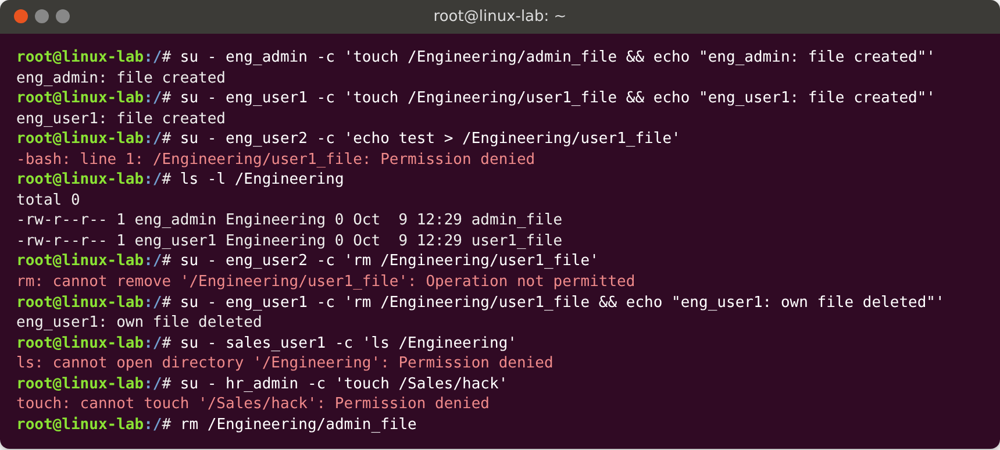

## Task 6: Create a document in each department directory

We create `confidential.txt` in each directory with `echo`, containing exactly one line of text (6b). `chown` gives the file the same ownership as its directory (6a). `chmod 640` sets the access (6c):

| Digit | Who | Permission |
|---|---|---|
| **6** | Owner (department admin) | read + write: only the admin can modify the file |
| **4** | Group (department users) | read only |
| **0** | Others | no permissions |

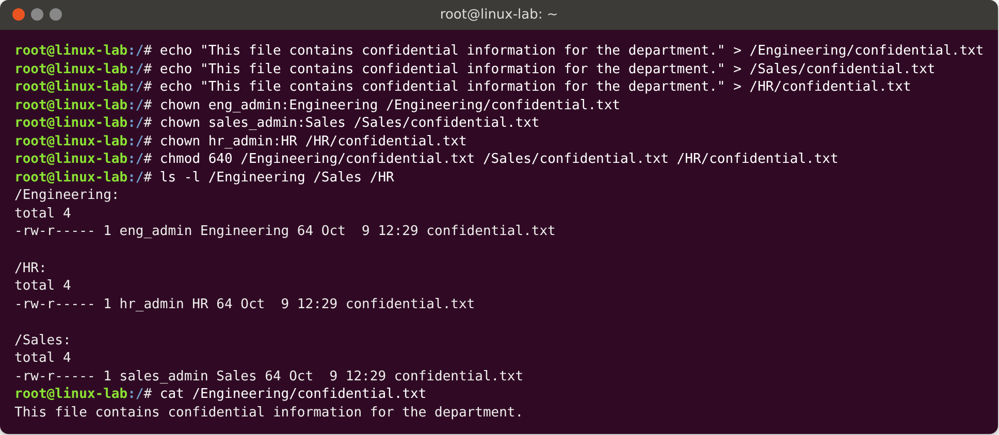

### Testing the file permissions

- A department user can read the file but gets *Permission denied* when trying to modify it.
- The department admin can modify it.
- Users from other departments cannot read it.

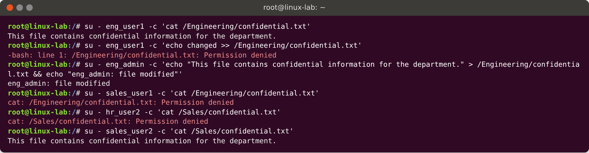

# Part 2 – User Management Script

## How the script works

The script `usermgmt.sh` is interactive and contains **no hardcoded usernames or group names**. The administrator types in the group name, username and password while it runs. The steps are in a logical order: the group must exist before the user (it becomes the user's primary group), and the user and group must exist before the directory can be given to them.

The special variable **`$?`** holds the exit code of the previous command: `0` means success and anything else means failure. The script uses it after each important command to decide what to do next.

0. **Root check.** The script exits with an error if it is not run as root, since every step below needs root privileges.
1. **(a) Create a new group.** A `while true` loop asks for a group name with `read -p`. An empty name is rejected. `getent group <name>` looks the name up. If `$?` is `0` the group already exists, so an error is printed and the loop asks for another name. Otherwise `groupadd` creates the group, `$?` confirms it worked, and `break` leaves the loop.
2. **(b) Create a new user.** The same loop pattern with `getent passwd <name>` rejects existing usernames. A unique user is created with `useradd -m -s /bin/bash -g <group> <user>`, which gives a Bash login shell and makes the new group the primary group.
3. **(c) Create a password.** The password is read twice with `read -s`, so it is hidden while typing. An empty or mismatching password is rejected and the admin tries again. The password is set with `chpasswd`, which stores it as a hash in `/etc/shadow`.
4. **(d) Group membership.** `usermod -aG <group> <user>` adds the user as a member of the group, so they are listed in `/etc/group` as well as having it as their primary group.
5. **(e) Directory.** `mkdir /<username>` creates a directory at the root with the same name as the user. If this fails, the script stops with an error.
6. **(f) Ownership.** `chown <user>:<group> /<username>`.
7. **(g + h) Permissions.** `chmod 1770` gives full control to the owner (`7`) and the group (`7`) and nothing to others (`0`). The leading `1` is the sticky bit, which means only the owner of a file can delete it from the directory.
8. **Summary.** Prints `id`, the `/etc/passwd` entry and `ls -ld` of the directory as proof.
9. **(i) Executable.** The script is made executable with `chmod +x usermgmt.sh` and run as `./usermgmt.sh` (or `sudo ./usermgmt.sh`).

## Script implementation

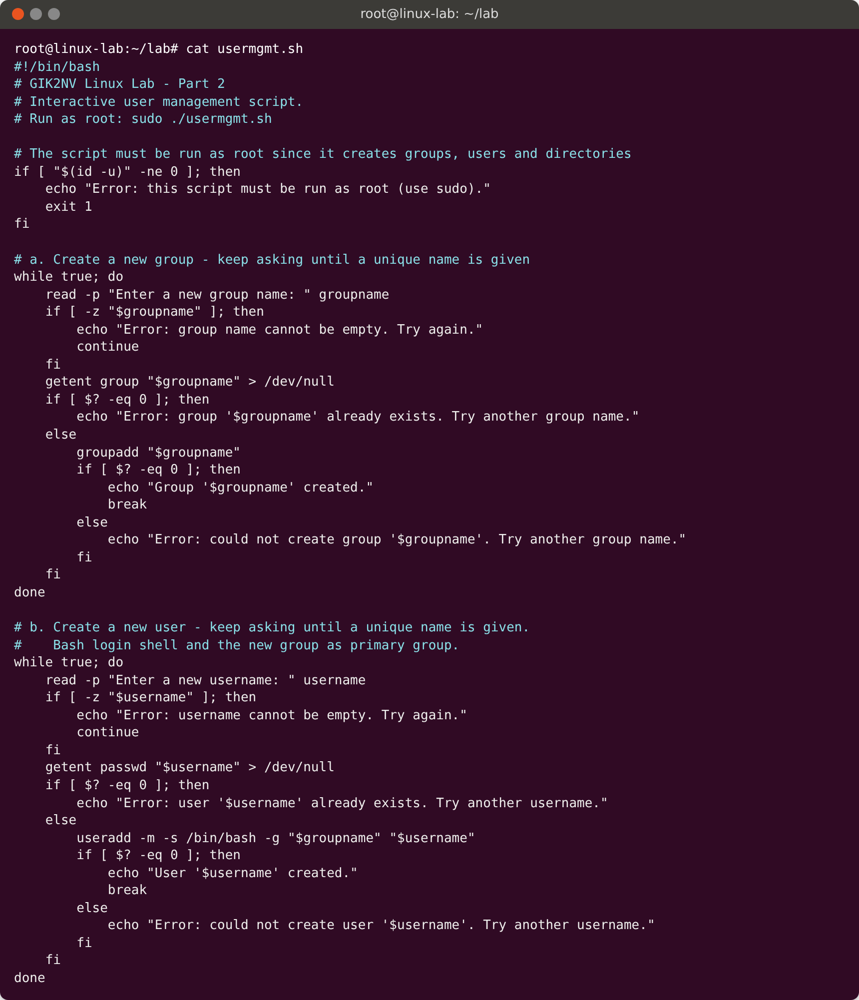

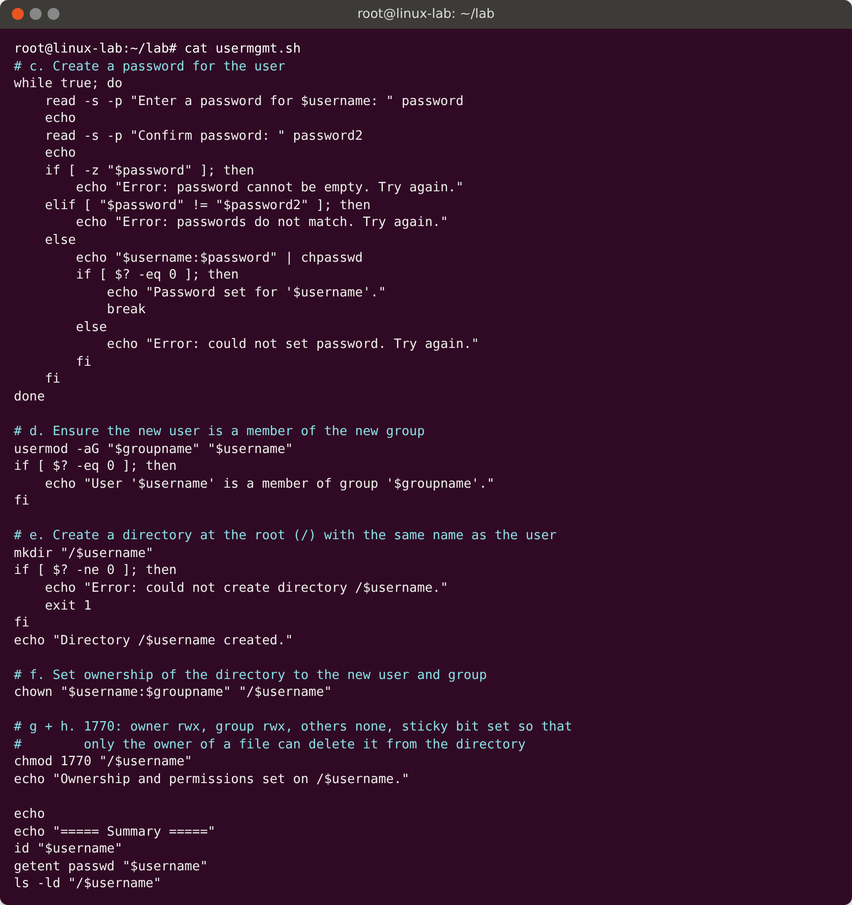

## Testing

### (i) Making the script executable

Before `chmod +x`, the file has no `x` bits (`-rw-r--r--`). Afterwards it is executable (`-rwxr-xr-x`).

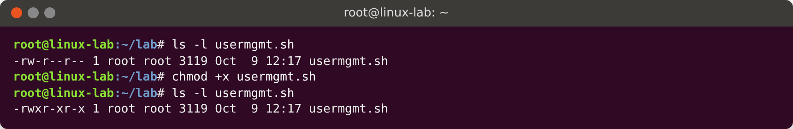

### Test 1: Duplicate group, duplicate user, wrong password, then valid input

This run tests every error branch:

- **(a)** `HR` already exists, so the script reports an error and asks again. `Marketing` is accepted.
- **(b)** `eng_admin` already exists, so the script reports an error. `anna` is accepted.
- **(c)** The two passwords did not match the first time, so the script asks again. The second attempt matched. The password is hidden while typing.
- **(d–h)** The rest of the script runs, and the summary shows the result.

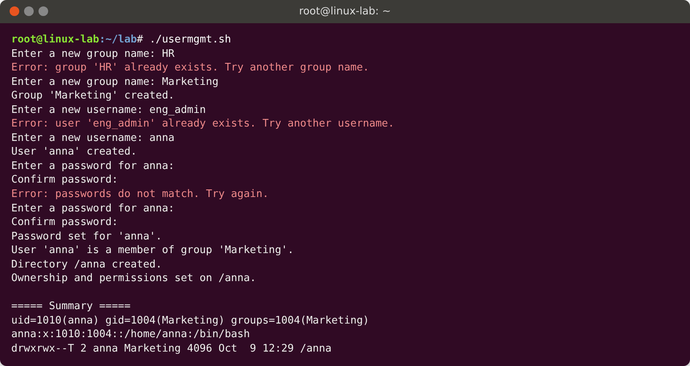

### Verification of Test 1

- `/etc/group` lists `anna` as a member of `Marketing` (a, d).
- `id` and `/etc/passwd` show that the primary group is `Marketing` and the shell is `/bin/bash` (b).
- `/etc/shadow` contains a password hash for `anna` (c).
- `/anna` exists at the root (e), is owned by `anna:Marketing` (f) and has permissions `drwxrwx--T` (g, h).
- `anna` can create files in it, and a user outside the group is denied access.

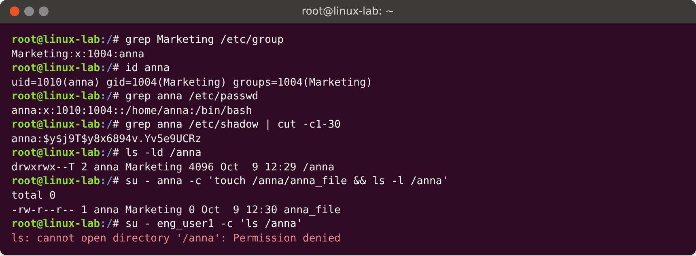

### Test 2: A second run with other names

This run shows that the script accepts any names. It also tests an empty group name, and the group and user created in Test 1 are now rejected as duplicates.

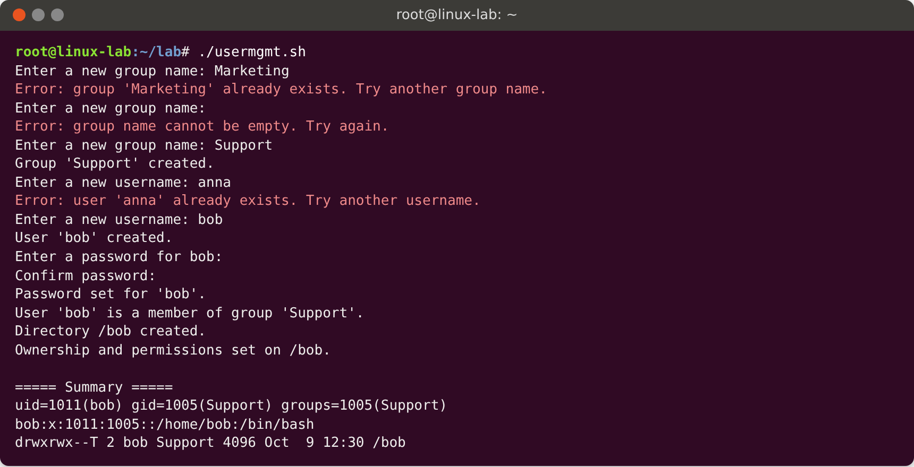

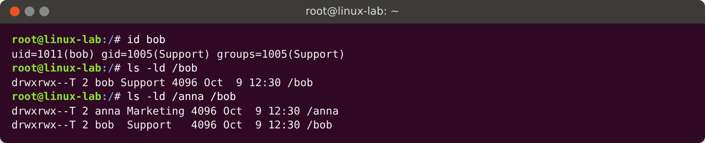

# Conclusion

**Part 1:** every department has a private directory owned by its administrator and group. All department members have full access, files can only be deleted by their owner, and other users have no access. Each directory has a confidential file that only the administrator can modify and that department members can read.

**Part 2:** the script automates the same work for any group and user name. It validates input with `getent` and `$?` so duplicates are rejected, and it produces a correctly configured user and directory every time.
